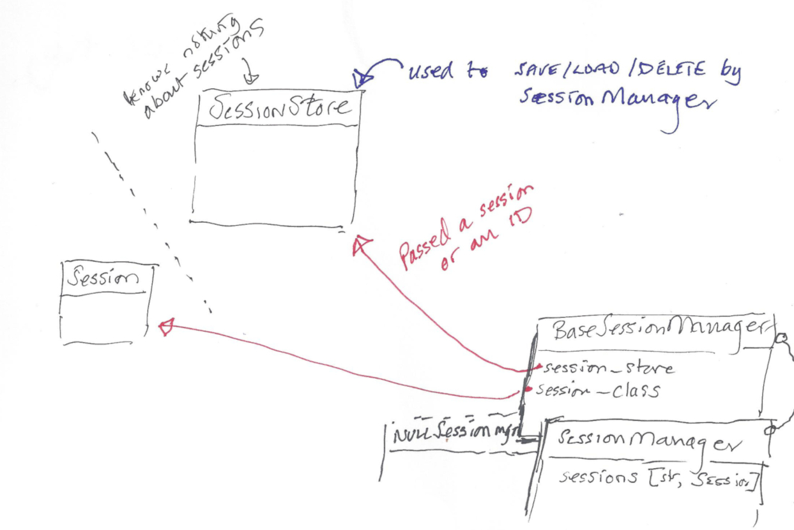

# Session 4 Release Notes

This release is to adjust Session 3's behaviour and structure to mimic Quixote 4's. It implements
a session class, a directory session-store class and a session manager class: the latter is merely
Quixote's BaseSessionManager with the addition of `__getitem__()` and `has_session()` functions[^1].

Session4's session class (Session4) differs from Quixote's base session in that `is_dirty` is
implemented and can automatically detect changes in attributes (either in their values or presence)
and with the addition of the `preserve_current_values()` function. Note that the mechanism uses
the attribute `_last_values` to compare with current values, so this attribute name should not be
modified by users of Session4.

A copy of Quixote's [session-mgmt.txt](session-mgmt.txt) is in the ``docs/`` directory for reference[^2],
but basically there is a session manager class that is responsible for sessions and how to store them by using a
session instance (in ``session_class``) and a store (in ``session_store``): Quixote calls upon
methods in the session manager at various points in the *request <-> response cycle*. Note that the
session store is blind to the contents of a session and a session knows nothing about its store
(which is handy as they can usually be swapped out).
At the moment, Session4 only supports a ``DirectorySessionStore`` which uses Python's pickling functions.

## Source layout (packaging only)

In a similar manner to Quixote itself, the package source has moved from ``session3/`` to
``src/session3``.

### *Footnotes*

[^1]: An issue for Quixote has been raised for these to be included in BaseSessionManager
(see https://github.com/nascheme/quixote/issues/8), at which point Session4SessionManager
will be removed (or merely aliased to BaseSessionManager).

[^2]: The Quixote documentation should be referred to for more detailed information
